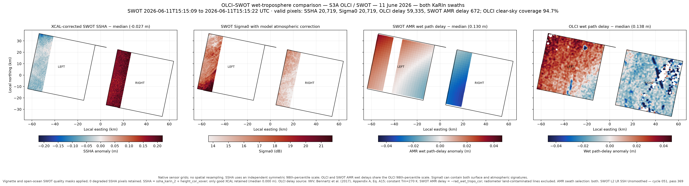

# OLCI cross-comparison with SWOT

Python tools for finding and analysing colocated Sentinel-3 OLCI and SWOT
observations over the ocean.

The search uses compact Orbit Revolution Files (ORFs). Large Level-2 products
are downloaded only for scenes that pass the geometric, temporal, ocean, and
OLCI clear-sky filters.

## Scientific objective

The project compares:

- OLCI total-column water vapour and its equivalent wet-tropospheric path
  delay;
- XCAL-corrected SWOT sea-surface-height anomaly:
  `ssha_karin_2 + height_cor_xover`;
- SWOT `sig0_karin_2`;
- the wet-tropospheric correction derived from the SWOT Advanced Microwave
  Radiometer.

The objective is to identify atmospheric structures visible in OLCI water
vapour and determine whether related signatures remain in corrected SWOT SSHA
or Sigma0.

Each sensor remains on its native grid. The software does not align or
artificially resample the sensor resolutions.

## Scene definition

- OLCI is represented by a nominal 1,270 km field of view.
- SWOT KaRIn consists of two swaths, from 10 to 60 km on each side of nadir.
- The left and right KaRIn swaths are always stored together as one scene.
- A complete SWOT scene spans approximately 120 km across track, including the
  20 km nadir gap.
- Long intersections are split into segments of at most 50 km along track.
- The default latitude interval is -66° to +66°.

The intersection GeoPackage contains:

- `vignettes`: one multipolygon per complete left-plus-right SWOT scene;
- `swaths`: the two component geometries, linked to the scene by
  `vignette_id`.

Combined and per-swath area, ocean fraction, and time-separation fields are
stored in the catalogue.

## Selection rule for OLCI clear sky

Clear-sky coverage is calculated independently for each SWOT swath from the
OLCI WQSF flags:

```text
left_pass  = clear_sky_percent_left  >= threshold
right_pass = clear_sky_percent_right >= threshold
scene_selected = left_pass OR right_pass
```

When either side passes, the complete scene is retained. The other swath is not
removed, even when it is cloudy.

The output reports both percentages, both pixel counts, both pass flags, the
best percentage, and `selected_swaths`.

## Example: 11 June 2026

The 11 June scene is representative of the cases sought for the 2026
campaign. It has a time separation of approximately one minute and both KaRIn
swaths are inside the same OLCI acquisition.

After refinement with native SWOT geolocation, OLCI clear-sky coverage is:

- right swath: 100.00%;
- left swath: 68.32%;
- pixel-weighted union: 84.23%.

The complete scene is selected because the right swath passes the 90%
threshold.



## Installation

Python 3.11 or newer is required.

### Windows PowerShell

```powershell
py -3.11 -m venv .venv
.\.venv\Scripts\python.exe -m pip install --upgrade pip
.\.venv\Scripts\python.exe -m pip install -e ".[dev]"
```

### Linux or macOS

```bash
python3.11 -m venv .venv
./.venv/bin/python -m pip install --upgrade pip
./.venv/bin/python -m pip install -e ".[dev]"
```

## Credentials

ORF intersection searches require no credentials.

OLCI catalogue queries and clear-sky screening require EUMETSAT API
credentials. SWOT product downloads require a NASA Earthdata bearer token.
Store these values outside the repository and pass the credential file with
`--credentials`.

Never commit API keys or tokens.

## Recommended 2026 search

The recommended campaign has three stages:

1. search all S3A/SWOT and S3B/SWOT ORF intersections;
2. calculate OLCI clear-sky coverage per left/right swath;
3. download full OLCI and SWOT science products only for the selected scenes.

### Important ORF coverage limitation

The ORFs currently included in this repository end on 1 August 2026. They
cannot yet cover the complete calendar year.

Run January-July now. To complete August-December, replace all three ORFs by
new versions covering at least 31 December 2026 and rerun the missing months.
Do not extrapolate the current ORFs beyond their last event.

### Stage 1 — monthly ORF intersection search

Monthly jobs are easier to monitor and restart than one year-long process. The
following PowerShell loop searches S3A and S3B from January through July 2026:

```powershell
$s3Orfs = @{
  S3A = "orbits\S3A_ORF_AXXCNE20260717_075300_20160302_154759_20260801_081654"
  S3B = "orbits\S3B_ORF_AXXCNE20260717_080700_20181123_213005_20260801_080330"
}
$swotOrf = "orbits\SWOT_ORF_AXXCNE20260717_103800_20230720_200750_20260801_081502"
$campaignStart = [datetime]"2026-01-01"
$campaignEnd = [datetime]"2026-08-01"

New-Item -ItemType Directory -Force "outputs\2026_orbit_search" | Out-Null

foreach ($platform in @("S3A", "S3B")) {
  for ($start = $campaignStart; $start -lt $campaignEnd; $start = $start.AddMonths(1)) {
    $end = $start.AddMonths(1).AddDays(-1)
    if ($end -ge $campaignEnd) {
      $end = $campaignEnd.AddDays(-1)
    }
    $label = $start.ToString("yyyy-MM")
    $startDate = $start.ToString("yyyy-MM-dd")
    $endDate = $end.ToString("yyyy-MM-dd")
    $output = "outputs\2026_orbit_search\${platform}_SWOT_${label}.gpkg"

    .\.venv\Scripts\find-s3-swot.exe `
      --s3-platform $platform `
      --s3-orf $s3Orfs[$platform] `
      --swot-orf $swotOrf `
      --start $startDate `
      --end $endDate `
      --dt-minutes 10 `
      --sample-seconds 30 `
      --prefilter-seconds 60 `
      --max-along-track-km 50 `
      --min-area-km2 2500 `
      --min-ocean-percent 100 `
      --min-latitude -66 `
      --max-latitude 66 `
      --land-resolution 110m `
      --output $output
  }
}
```

Recommended first-pass criteria:

- `dt <= 10 minutes`;
- paired-scene area at least 2,500 km², approximately equivalent to two
  50 km-wide swaths over at least 25 km along track;
- 100% ocean according to the selected Natural Earth screening mask;
- latitude between -66° and +66°.

The 30-second orbital sampling and 110m land mask are intended for candidate
discovery. Native SWOT geolocation and the 10m land mask should be used only
for final refinement.

When updated ORFs covering the entire year are available, set:

```powershell
$campaignEnd = [datetime]"2027-01-01"
```

### Stage 2 — clear-sky screening

Pass all monthly S3A and S3B catalogues to one invocation. This allows scenes
belonging to the same OLCI product to share a single download:

```powershell
$catalogArguments = foreach (
  $catalog in Get-ChildItem "outputs\2026_orbit_search\*.gpkg"
) {
  "--catalog"
  $catalog.FullName
}

.\.venv\Scripts\python.exe scripts\screen_olci_clear_sky.py `
  @catalogArguments `
  --credentials "C:\path\outside\the\repository\credentials.txt" `
  --temporary-directory "data\temporary_olci_screening" `
  --collection "EO:EUM:DAT:0407" `
  --min-width-km 25 `
  --min-length-km 100 `
  --browse-clear-min 80 `
  --clear-sky-min 90 `
  --query-workers 8 `
  --download-workers 4 `
  --output "outputs\OLCI_SWOT_2026_selected.gpkg"
```

The output contains the full paired scenes for which at least one swath has
90% clear-sky coverage. Temporary files are deleted product by product unless
`--keep-temporary` is supplied.

### Is clear-sky screening the slowest stage?

Usually yes in wall-clock time, because it requires EUMETSAT catalogue calls
and network transfers.

For each unique OLCI product, the screener:

1. downloads `browse.jpg` and `tie_geo_coordinates.nc`;
2. rejects scenes that fail the inexpensive browse-availability test on both
   swaths;
3. downloads `wqsf.nc` only when at least one side passes that prefilter;
4. calculates exact WQSF clear-sky coverage for both swaths;
5. deletes the temporary files.

The full OLCI science product is not downloaded during screening. The ORF
intersection calculation can also take several hours over a full year, but it
is local, restartable by month, and does not depend on an external API.

### Stage 3 — native refinement of a selected scene

Use one paired scene identifier:

```powershell
.\.venv\Scripts\python.exe scripts\refine_swot_native_swaths.py `
  --catalog "outputs\OLCI_SWOT_2026_selected.gpkg" `
  --vignette-id <paired-scene-id> `
  --swot "data\validation_case\swot\<SWOT Unsmoothed granule>.nc" `
  --output-vignette "outputs\selected_scene_native.gpkg" `
  --output-dir "data\selected_scene"
```

This writes separate native two-dimensional left and right KaRIn subsets while
preserving the common scene identifier.

## OLCI wet-path-delay conversion

After downloading the selected OLCI product:

```powershell
.\.venv\Scripts\python.exe scripts\convert_olci_tcwv.py `
  --input "data\validation_case\olci\iwv.nc" `
  --geolocation "data\validation_case\olci\geo_coordinates.nc" `
  --quality-file "data\validation_case\olci\wqsf.nc" `
  --vignette "outputs\selected_scene_native.gpkg" `
  --vignette-id <paired-scene-id> `
  --mean-temperature-k 270 `
  --output "data\selected_scene\IWV_with_wet_delay.nc"
```

The conversion produces positive one-way zenith wet path delay in metres. It
uses the Bennartz et al. formulation and a constant water-vapour-weighted mean
temperature unless `--tm-variable` is supplied.

## Four-panel comparison

```powershell
.\.venv\Scripts\python.exe scripts\plot_swot_validation.py `
  --subset "data\selected_scene\swot_subset_left_native.nc" `
  --subset "data\selected_scene\swot_subset_right_native.nc" `
  --olci "data\selected_scene\IWV_with_wet_delay.nc" `
  --swot-expert "data\validation_case\swot\<SWOT Expert granule>.nc" `
  --vignette "outputs\selected_scene_native.gpkg" `
  --vignette-id <paired-scene-id> `
  --land "data\natural_earth\ne_10m_land.zip" `
  --scale-mode independent `
  --output "outputs\selected_scene_comparison.png"
```

The panels are:

1. XCAL-corrected SWOT SSHA anomaly;
2. SWOT Sigma0;
3. SWOT AMR wet-path-delay anomaly;
4. OLCI-derived wet-path-delay anomaly.

The left and right AMR meshes are rendered separately to avoid false cells
across the nadir gap.

## Testing

```powershell
.\.venv\Scripts\python.exe -m pytest -q
```

## Repository layout

```text
orbits/                 Sentinel-3A, Sentinel-3B, and SWOT ORFs
src/satmatch/           ORF parsing, geometry, ocean mask, matchup engine
scripts/                Screening, download, conversion, refinement, plotting
tests/                  Unit and workflow tests
```

Generated `data/` and `outputs/` directories are ignored by Git. The
repository does not redistribute EUMETSAT or NASA Level-2 products.
